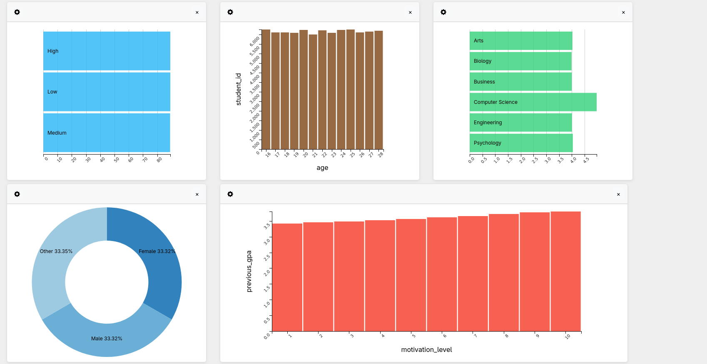

<pre>
#        _       _        _____            __ _ _           
#       | |     | |      |  __ \          / _(_) |          
#     __| | __ _| |_ __ _| |__) | __ ___ | |_ _| | ___ _ __ 
#    / _` |/ _` | __/ _` |  ___/ '__/ _ \|  _| | |/ _ \ '__|
#   | (_| | (_| | || (_| | |   | | | (_) | | | | |  __/ |   
#    \__,_|\__,_|\__\__,_|_|   |_|  \___/|_| |_|_|\___|_|   
#                                                           
#                                                           
</pre>

### Interactive dashboards

A quick and easy way to create interactive dashboards offline. Powered by D3.js, dc.js and Crossfilter.js.

## Requirements and dependencies

#### Javascript
* Bootstrap 4
* dc.js 4
* d3.js 5
* crossfilter.js 1.5

## Current features

* Bar charts
* Row charts
* Line charts
* Pie charts
* Tables
* Export dashboard to single html, preserving functionalities.

## Usage

1. Load the data file in csv format.
2. Add a chart element.
3. Configure the chart element.

## Screenshots

